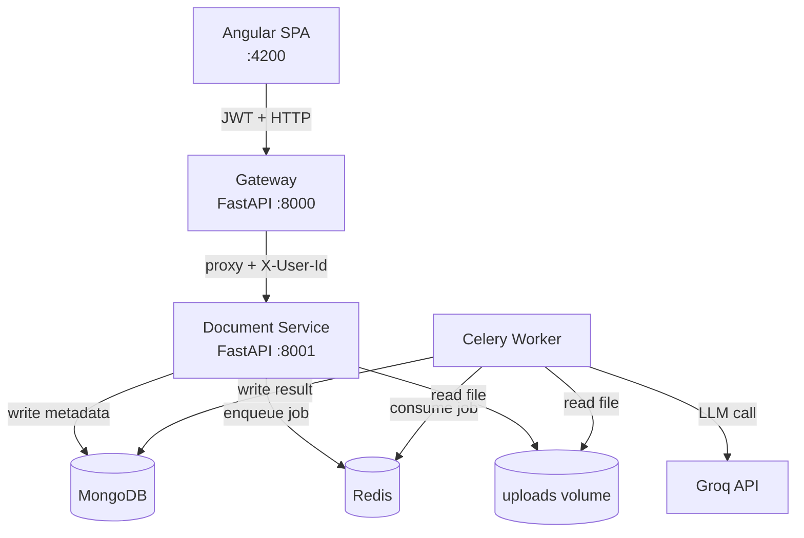

# DocuParse

[](https://github.com/daniyalmlik10/DocuParse/actions/workflows/ci.yml)


Upload a PDF or DOCX resume, watch an async pipeline extract structured data with an LLM, and view the result in a clean Angular UI. The system is split into three independently deployable services — a FastAPI gateway that handles auth and proxying, a document service that owns file storage and metadata, and a Celery worker that runs the LLM extraction — because upload is milliseconds and LLM calls are seconds: they have no business sharing a process.

---

## Architecture



**Services**

| Service | Port | Responsibility |
|---|---|---|
| Gateway | 8000 | RS256 JWT auth, reverse proxy, token refresh |
| Document | 8001 | File upload, metadata CRUD, job orchestration |
| Worker | — | Text extraction (pypdf/python-docx), Groq LLM call, result persistence |
| Frontend | 4200 | Angular SPA — upload, list, detail views |

---

## Why microservices

The workload has genuinely asymmetric latency profiles. A file upload completes in milliseconds; an LLM extraction takes 2–5 seconds. Coupling them in one process means a queue of slow extractions backs up and delays every HTTP response. The Celery worker scales horizontally without touching the API layer, and each service can fail and restart independently. Kafka would be over-engineering for this volume; a monolith would tie together latency profiles that have nothing in common. This is the right trade-off at this scale.

---

## Screenshot


*Structured extraction output — candidate header, skills chips, experience timeline, and education cards — rendered from Groq's JSON response.*

> **To add your own:** run the stack, upload a resume, navigate to `/documents/:id`, and replace `docs/screenshot.png`.

---

## Local setup

```bash
# 1. Clone and configure
cp .env.example .env          # fill in GROQ_API_KEY and generate JWT keys (see .env.example)

# 2. Start everything
docker compose up --build

# 3. Open the app
# http://localhost:4200
```

All six containers start with healthchecks. The first `docker compose up --build` takes ~2 minutes; subsequent starts are fast.

---

## Tech stack

| Layer | Technology | Key libraries |
|---|---|---|
| Gateway | Python 3.11 / FastAPI | python-jose (RS256 JWT), passlib[bcrypt], httpx |
| Document service | Python 3.11 / FastAPI | motor (async MongoDB), aiofiles, python-multipart |
| Extraction worker | Python 3.11 / Celery | pypdf, python-docx, httpx (Groq), tenacity |
| Frontend | Angular 20+ / TypeScript | Signals, RxJS, Tailwind CSS 4, standalone components |
| Data stores | MongoDB 7, Redis 7-alpine | motor driver, Redis as Celery broker + result backend |
| Container | Docker Compose | Per-service Dockerfiles, nginx for frontend, named volume for uploads |
| CI | GitHub Actions | Matrix job per service — ruff + pytest; ESLint + ng build + ng test |

Shared Pydantic v2 contracts live in `/shared/docuparse_contracts/` and are installed into each service as a local editable package, eliminating duplicated model definitions across service boundaries.

---

## What I'd add next

- **OCR fallback** — Tesseract + pdf2image for scanned (non-digital-native) PDFs
- **S3/MinIO storage** — replace the shared Docker volume with object storage; removes the coupling between Document and Worker containers
- **WebSocket status streaming** — replace the 2s HTTP polling loop with a WebSocket channel; cleaner UX, one less polling request per active document
- **Distributed tracing** — OpenTelemetry SDK in each service, Jaeger collector, Grafana dashboard; makes latency attribution across the async boundary observable
- **Multi-provider LLM routing** — OpenRouter as fallback behind the `LLMProvider` base class already in the worker; graceful degradation when Groq rate-limits
- **Kubernetes manifests** — Deployment + HPA for the Celery worker (the one service that actually benefits from autoscaling), Services for the rest
- **Rate limiting** — slowapi on the Gateway; protect the Groq API key from abuse without touching downstream services

---

## Extensibility

Adding a new document type (invoice, contract) requires exactly two changes: a new Celery task in `services/worker/app/tasks/` and a new Pydantic schema in `shared/docuparse_contracts/`. No service boundaries change, no new services needed.

---

## Repo layout

```
/services
  /gateway        FastAPI — auth + reverse proxy
  /document       FastAPI — upload, metadata, job dispatch
  /worker         Celery — text extraction + LLM call
/shared
  /docuparse_contracts   Pydantic v2 models shared across services
/frontend         Angular 20+ SPA
/.github/workflows/ci.yml
/docs             Screenshots and assets
docker-compose.yml
.env.example
```

---

## Running tests

```bash
# Backend (per service)
cd services/gateway && pytest
cd services/document && pytest
cd services/worker && pytest

# Frontend
cd frontend && npx ng test --watch=false
```

CI runs the full matrix on every push and pull request.
